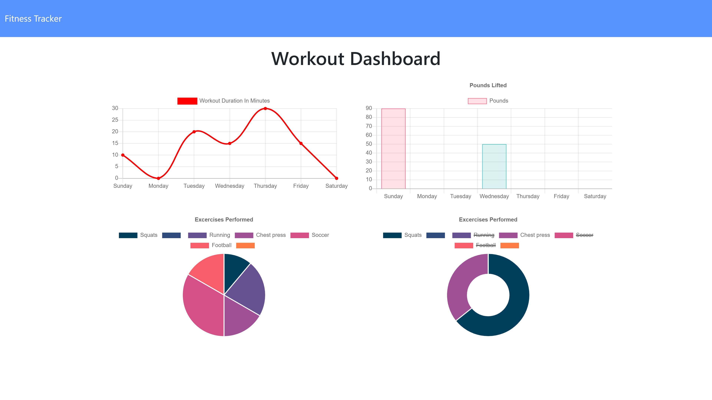
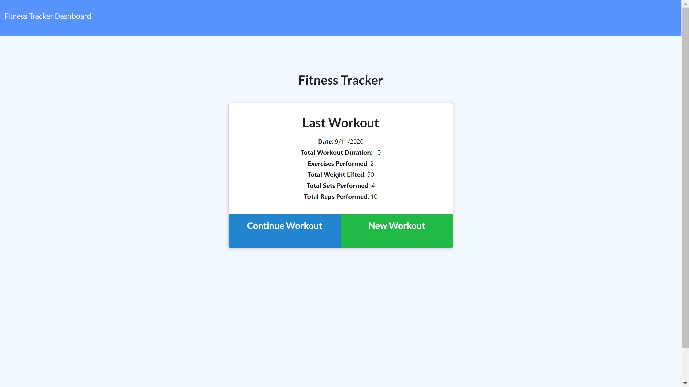

  # **Fitness-Tracker**

  This application allows you to track your workouts. The app will help you keep track of every exercise in your workout. The dashboard displays weekly summary graphs of your workouts throughout the week.
   
   
   
   
   ## Table of contents

  * [Description](#Description)
  * [Installation](#Installation)
  * [Usage](#Usage)
  * [License](#License)
  * [Contributors](#Contributors)
  * [Test](#Test)
  * [Questions](#Questions)
  
  ## License
  
  

  

  ## Installation
  
  run npm i from cli then node server.js

  ## Usage
  

  ## License
  

  ## Contributing
      
  Oscar Chiriboga
  
  Link to GitHub: https://github.com/cracso

  ## Technologies

  * Node Js
  * Express
  * Mongo DB
  * mongoose
  * Morgan(dev)
  * HTML
  * CSS
  

  ## Questions
  
  Email address: oscarmchiriboga@gmail.com
  
